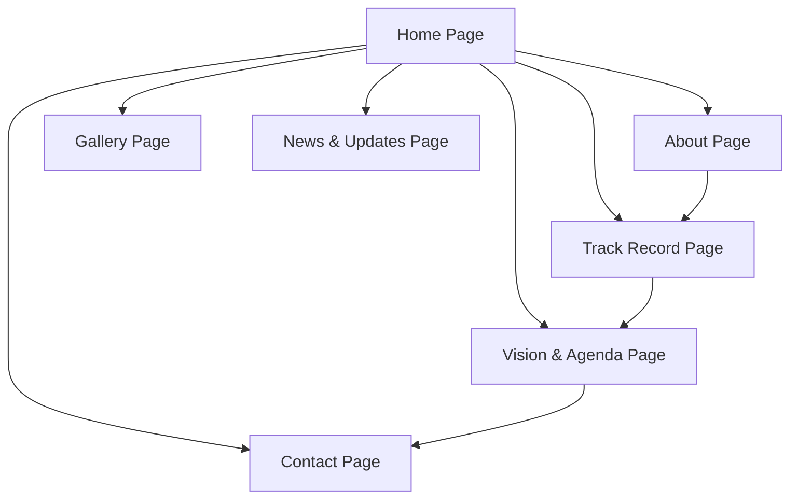

## 1. Product Overview
A modern, professional campaign website for Hon. Hassan Mamman Barguma, an APC aspirant for the House of Representatives representing Hong/Gombi Federal Constituency, Adamawa State, Nigeria. The platform establishes trust with voters through transparent showcasing of track records, vision, and grassroots engagement while performing optimally on low-bandwidth mobile connections.
This website serves as the central hub for campaign communications, connecting constituents with the candidate's achievements, agenda, and opportunities to participate in the movement, targeting both urban educated voters and rural communities in the constituency.

## 2. Core Features

### 2.1 User Roles
| Role | Registration Method | Core Permissions |
|------|---------------------|------------------|
| Constituent Visitor | No registration required | Browse all public content, sign up for newsletter, submit contact forms |
| Campaign Volunteer | Sign up via Contact/Get Involved page | Access volunteer-specific resources and receive campaign updates |
| Website Administrator | Secured backend login | Manage news updates, gallery content, edit website information, view form submissions |

### 2.2 Feature Module
The campaign website consists of the following main pages:
1. **Home Page**: Hero section, animated stats bar, introduction snippet, featured projects, vision block, endorsements, supporter sign-up
2. **About Page**: Structured biography with early life, professional background, political journey, legislative highlights, post-legislative work, personal philosophy
3. **Track Record Page**: Tabbed sections for infrastructure projects, facilitated projects, empowerment programs, legislative records
4. **Vision & Agenda Page**: Pillar-structured federal legislative agenda with manifesto download placeholder
5. **Gallery Page**: Photo grid with categorized campaign and community images
6. **News & Updates Page**: Blog-style layout for campaign news, press releases, and social media integration
7. **Contact / Get Involved Page**: Contact form, volunteer sign-up, campaign office information, social media links

### 2.3 Page Details
| Page Name | Module Name | Feature description |
|-----------|-------------|---------------------|
| Home Page | Hero Section | Display full-width banner with main tagline and sub-tagline; implement three CTA buttons linking to About, Vision & Agenda, and Contact pages respectively |
| Home Page | Animated Stats Bar | Render animated counters that increment on scroll to showcase key achievements: 36 boreholes, 170 scholarships, 152 jobs, 23+ projects, ₦2.34M loans offset |
| Home Page | Introduction Snippet | Present 3-sentence candidate summary with link to full About page for detailed biography |
| Home Page | Featured Projects | Display 3-4 project cards with category icons (Education, Health, Roads, Water) summarizing key constituency achievements |
| Home Page | Quote/Vision Block | Highlight candidate's vision pull quote in prominent, stylized format to emphasize leadership philosophy |
| Home Page | Endorsement Section | Create placeholder section to feature endorsements from community leaders, youth groups, women's organizations, and religious bodies |
| Home Page | Newsletter Sign-Up | Implement simple form capturing Name, Phone Number, Ward, and optional Email to register supporters |
| About Page | Biography Sections | Present structured content across Early Life & Education, Professional Background, Political Journey, Legislative Career Highlights, and Post-Legislative Work |
| About Page | Personal Philosophy Sidebar | Display Kilba adage with English translation to showcase cultural heritage and values |
| Track Record Page | Tabbed Navigation | Implement tabbed interface to organize content into Infrastructure Projects, Facilitated Projects, Empowerment & Employment, and Legislative Record |
| Track Record Page | Infrastructure Projects | Create numbered project list with icons; embed constituency map with location pins for all 23 direct projects |
| Track Record Page | Empowerment Section | Render visual cards for empowerment metrics: 170 Scholarships, 13 Cars Donated, Women's SME Programme, ₦2.34M Loans Offset, 152 Jobs Facilitated, Skills Training |
| Track Record Page | Legislative Record | Build accordion-style component to organize bills sponsored and motions moved by thematic categories |
| Vision & Agenda Page | Agenda Pillars | Present 7 key legislative pillars (Education, Healthcare, Infrastructure, Agriculture, Youth & Women, Security, Accountability) with detailed descriptions |
| Vision & Agenda Page | Manifesto Download | Add placeholder button for formal manifesto PDF download once available |
| Gallery Page | Photo Grid | Implement 3-column/masonry layout for categorized images: project commissions, community engagements, empowerment programs, campaign events, legislative photos |
| Gallery Page | Image Captions | Support descriptive captions for each photo to provide context for constituents |
| News & Updates Page | Blog Layout | Create blog-style layout for campaign news, press releases, constituency updates, media mentions, and event announcements |
| News & Updates Page | Social Integration | Integrate Facebook, X, and WhatsApp Channel feeds in sidebar to aggregate social media content |
| Contact Page | Contact Form | Build form capturing Name, Phone, Email, Ward, and Message for constituent inquiries |
| Contact Page | Volunteer Sign-Up | Implement volunteer registration with dropdown for interest areas: Youth Mobilisation, Women's Wing, Campaign Management, Social Media, Logistics, Other |
| All Pages | Floating WhatsApp Button | Maintain persistent "Chat with Campaign Team" WhatsApp button accessible across all website pages |

## 3. Core Process
Visitors navigate the website primarily through the sticky top navigation bar, with key flows including:
1. First-time visitors land on the Home Page, can explore candidate background via About page, review past achievements on Track Record, or learn about future plans on Vision & Agenda
2. Constituents interested in supporting the campaign can sign up as volunteers or join the newsletter directly from the Home Page or Contact page
3. Media and researchers can access press materials through the News & Updates page and view campaign imagery in the Gallery
4. All users can submit inquiries or volunteer applications through the Contact/Get Involved page, with submissions routed to campaign administrators

## 4. User Interface Design
### 4.1 Design Style
- **Primary Colors**: APC green (#008000), white
- **Accent Colors**: Gold/amber (#D4AF37) for CTAs and highlights; deep navy (#1A2E4A) for text
- **Typography**: Playfair Display (serif) for headings; Inter (sans-serif) for body text for optimal readability
- **Layout**: Card-based design with sticky top navigation; mobile-first responsive grid system
- **Buttons**: Rounded rectangular buttons with hover states; primary CTAs in gold, secondary in APC green
- **Icons**: Simple, bold line icons for project categories and navigation; clear visual hierarchy

### 4.2 Page Design Overview
| Page Name | Module Name | UI Elements |
|-----------|-------------|-------------|
| Home Page | Hero Section | Full-width banner with overlay text; CTA buttons in gold with hover effects; responsive image placeholder for candidate portrait |
| Home Page | Stats Bar | Flex layout across five columns; animated number counters; light background with navy text; APC green accent for numbers |
| All Pages | Navigation | Sticky top bar with candidate name/logo on left; navigation links centered; "Join the Movement" CTA in APC green on right |
| Track Record Page | Tab Interface | Tabbed navigation with gold active state; map with pinned project locations; accordion components for legislative records with smooth transitions |
| Gallery Page | Photo Grid | 3-column responsive grid; image cards with slight shadow on hover; captions below each image in small navy text |

### 4.3 Responsiveness
Mobile-first design approach with full responsiveness across all screen sizes; touch-optimized interactions for Android smartphone users who constitute the majority of constituents; all images lazy-loaded to ensure performance on 3G connections.

### 4.4 Performance Optimization
All images compressed and lazy-loaded; code splitting implemented to minimize initial bundle size; target sub-3-second load time on 3G networks; offline support considerations for low-connectivity areas.