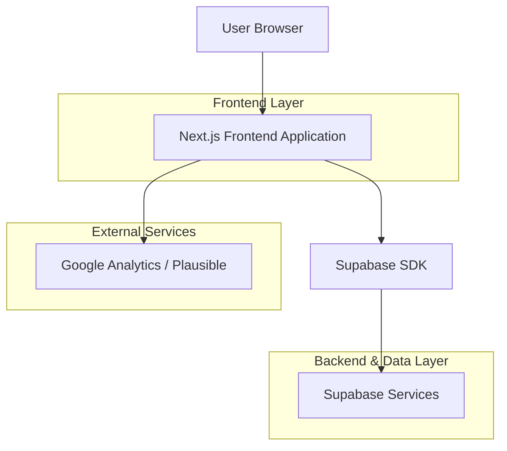
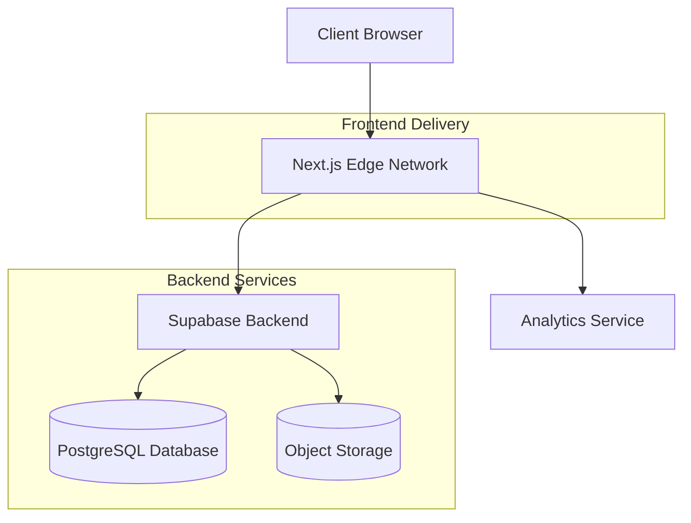
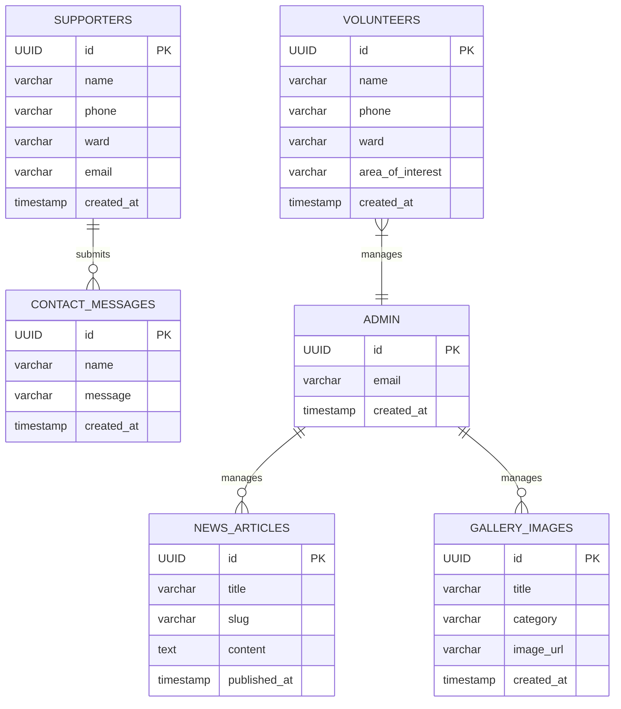

## 1. Architecture Design


## 2. Technology Description
- Frontend: Next.js 14 (React 18) + TailwindCSS 3 + TypeScript
- Initialization Tool: create-next-app
- Backend: Supabase (Authentication, Database, Storage)
- Analytics: Plausible (privacy-focused) or Google Analytics
- Image Optimization: Next.js Image component with lazy loading

## 3. Route Definitions
| Route | Purpose |
|-------|---------|
| / | Home page with hero section, stats, and featured content |
| /about | Biography and background of Hon. Hassan Mamman Barguma |
| /track-record | Detailed achievements and legislative history |
| /vision-agenda | Future legislative agenda and policy priorities |
| /gallery | Campaign and community photo gallery |
| /news | Blog and news updates section |
| /contact | Contact form, volunteer sign-up, and campaign information |

## 4. API Definitions
### 4.1 Core Supabase Database APIs
#### Supporter Sign-Up
```sql
-- Supporters table for newsletter sign-ups
CREATE TABLE supporters (
    id UUID PRIMARY KEY DEFAULT gen_random_uuid(),
    name VARCHAR(255) NOT NULL,
    phone VARCHAR(20) NOT NULL,
    ward VARCHAR(100) NOT NULL,
    email VARCHAR(255),
    created_at TIMESTAMP WITH TIME ZONE DEFAULT NOW()
);

-- Enable RLS
ALTER TABLE supporters ENABLE ROW LEVEL SECURITY;
CREATE POLICY "Anyone can insert supporters" ON supporters FOR INSERT WITH CHECK (true);
CREATE POLICY "Only admins can view supporters" ON supporters FOR SELECT USING (auth.role() = 'authenticated');
```

#### Contact Form Submissions
```sql
-- Contact messages table
CREATE TABLE contact_messages (
    id UUID PRIMARY KEY DEFAULT gen_random_uuid(),
    name VARCHAR(255) NOT NULL,
    phone VARCHAR(20) NOT NULL,
    email VARCHAR(255),
    ward VARCHAR(100) NOT NULL,
    message TEXT NOT NULL,
    created_at TIMESTAMP WITH TIME ZONE DEFAULT NOW()
);

ALTER TABLE contact_messages ENABLE ROW LEVEL SECURITY;
CREATE POLICY "Anyone can insert messages" ON contact_messages FOR INSERT WITH CHECK (true);
CREATE POLICY "Only admins can view messages" ON contact_messages FOR SELECT USING (auth.role() = 'authenticated');
```

#### Volunteer Registrations
```sql
-- Volunteers table
CREATE TABLE volunteers (
    id UUID PRIMARY KEY DEFAULT gen_random_uuid(),
    name VARCHAR(255) NOT NULL,
    phone VARCHAR(20) NOT NULL,
    ward VARCHAR(100) NOT NULL,
    area_of_interest VARCHAR(100) NOT NULL,
    created_at TIMESTAMP WITH TIME ZONE DEFAULT NOW()
);

ALTER TABLE volunteers ENABLE ROW LEVEL SECURITY;
CREATE POLICY "Anyone can register as volunteer" ON volunteers FOR INSERT WITH CHECK (true);
CREATE POLICY "Only admins can view volunteers" ON volunteers FOR SELECT USING (auth.role() = 'authenticated');
```

#### News Articles
```sql
-- News and updates table
CREATE TABLE news_articles (
    id UUID PRIMARY KEY DEFAULT gen_random_uuid(),
    title VARCHAR(255) NOT NULL,
    slug VARCHAR(255) UNIQUE NOT NULL,
    content TEXT NOT NULL,
    featured_image_url VARCHAR(500),
    published_at TIMESTAMP WITH TIME ZONE DEFAULT NOW(),
    created_at TIMESTAMP WITH TIME ZONE DEFAULT NOW(),
    updated_at TIMESTAMP WITH TIME ZONE DEFAULT NOW()
);

ALTER TABLE news_articles ENABLE ROW LEVEL SECURITY;
CREATE POLICY "Anyone can view published news" ON news_articles FOR SELECT USING (true);
CREATE POLICY "Only admins can manage news" ON news_articles FOR ALL USING (auth.role() = 'authenticated');
```

#### Gallery Images
```sql
-- Gallery media table
CREATE TABLE gallery_images (
    id UUID PRIMARY KEY DEFAULT gen_random_uuid(),
    title VARCHAR(255) NOT NULL,
    caption TEXT,
    category VARCHAR(100) NOT NULL,
    image_url VARCHAR(500) NOT NULL,
    created_at TIMESTAMP WITH TIME ZONE DEFAULT NOW()
);

ALTER TABLE gallery_images ENABLE ROW LEVEL SECURITY;
CREATE POLICY "Anyone can view gallery" ON gallery_images FOR SELECT USING (true);
CREATE POLICY "Only admins can manage gallery" ON gallery_images FOR ALL USING (auth.role() = 'authenticated');
```

## 5. Server Architecture


## 6. Data Model
### 6.1 Entity Relationship Diagram


### 6.2 Performance Optimizations
- Next.js Image component for automatic image optimization and lazy loading
- Static page generation for most content to enable CDN caching
- Incremental Static Regeneration for news and gallery updates
- Code splitting to reduce initial bundle size below 100KB
- Compressed assets and minimal JavaScript for 3G network performance